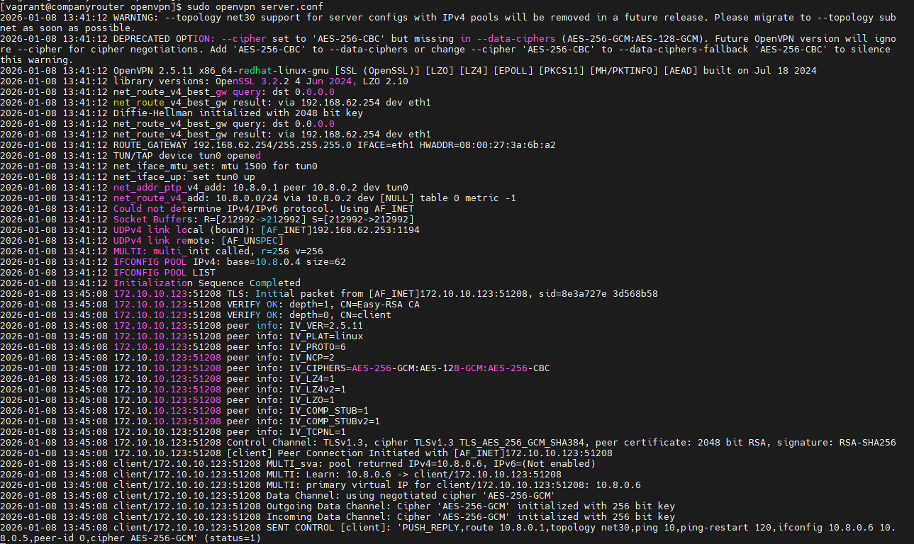
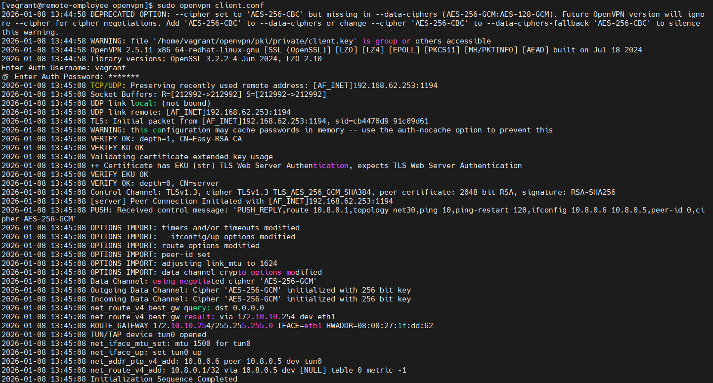

# Lab Report – OpenVPN Site-to-Client Configuration

## 1. Doel van het labo

Het doel van dit labo is het opzetten van een **site-to-client VPN-verbinding** met **OpenVPN**, waarbij een externe werknemer veilig toegang krijgt tot het interne bedrijfsnetwerk.
De VPN-server draait op de **company router**, en authenticatie gebeurt met **PKI-certificaten** gegenereerd via **Easy-RSA**.
TLS-authenticatie (`ta.key`) wordt **niet gebruikt** in deze opstelling.

---

## 2. Netwerkopstelling

### 2.1 Netwerkcomponenten

| Component       | Rol             | IP-adres       |
| --------------- | --------------- | -------------- |
| Company Router  | OpenVPN server  | 192.168.62.253 |
| Webserver       | Interne service | 172.30.0.10    |
| Remote Employee | OpenVPN client  | 172.10.10.123  |

---

## 3. Certificaatinfrastructuur (Easy-RSA)

### 3.1 PKI-locatie

De PKI werd aangemaakt via Easy-RSA en bevindt zich op:

```
/usr/share/easy-rsa/3.2.1/pki/
```

### 3.2 Gebruikte certificaten

| Bestand            | Beschrijving        |
| ------------------ | ------------------- |
| ca.crt             | Root CA certificaat |
| issued/server.crt  | Servercertificaat   |
| private/server.key | Serversleutel       |
| issued/client.crt  | Clientcertificaat   |
| private/client.key | Clientsleutel       |

---

## 4. Serverconfiguratie (company router)

### 4.1 OpenVPN serverconfiguratie (`server.conf`)

```conf
port 1194
proto udp
dev tun

local 192.168.62.253

ca /usr/share/easy-rsa/3.2.1/pki/ca.crt
cert /usr/share/easy-rsa/3.2.1/pki/issued/server.crt
key /usr/share/easy-rsa/3.2.1/pki/private/server.key
dh /usr/share/easy-rsa/3.2.1/pki/dh.pem

server 10.8.0.0 255.255.255.0
```

> **Opmerking:**
> De server wordt expliciet gebonden aan zijn **externe IP-adres** via de `local` directive.

---

## 5. Clientconfiguratie (remote employee)

### 5.1 OpenVPN clientconfiguratie (`client.conf`)

```conf
client
dev tun
proto udp

remote 192.168.62.253 1194

ca /home/vagrant/pki/ca.crt
cert /home/vagrant/pki/issued/client.crt
key /home/vagrant/pki/private/client.key

```

---

## 6. Routing en forwarding

### 6.1 IP forwarding inschakelen (server)

```bash
echo 1 > /proc/sys/net/ipv4/ip_forward
```

Permanent maken:

```bash
sysctl -w net.ipv4.ip_forward=1
```

---

### 6.2 NAT-regel op de server

```bash
iptables -t nat -A POSTROUTING -s 10.8.0.0/24 -o eth0 -j MASQUERADE
```

---

## 7. Starten van de VPN

### 7.1 Server starten

```bash
sudo openvpn server.conf
```

 output:




---

### 7.2 Client starten

```bash
sudo openvpn client.conf
```

output:



---

## 8. Testen van de verbinding

### 8.1 Controle van tunnelinterface

```bash
ip a show tun0
```

➡️ Client krijgt een IP-adres in `10.8.0.0/24`

---

### 8.2 Connectiviteitstest

```bash
ping 172.30.0.10
```

➡️ Ping naar de interne webserver slaagt.

---

## 9. Gemaakte fouten en probleemoplossing

### 9.1 Fout 1 – Onjuist gebruik van IP-adres in clientconfiguratie

**Probleem:**

```
Options error: Unrecognized option ... 192.168.62.253
```

**Oorzaak:**
Het IP-adres van de server stond op een aparte lijn zonder directive.

**Oplossing:**
Het IP-adres werd correct toegevoegd via de `remote` directive:

```conf
remote 192.168.62.253 1194
```

---

### 9.2 Fout 2 – TLS-authenticatie zonder `ta.key`

**Probleem:**

```
Cannot pre-load keyfile (ta.key)
```

**Oorzaak:**
De `tls-auth` optie was actief terwijl er geen `ta.key` bestand werd gegenereerd.
TLS-authenticatie werd bovendien bewust niet gebruikt in dit labo.

**Oplossing:**
De `tls-auth` directive werd uitgeschakeld op zowel server als client:

```conf
;tls-auth ta.key 1
```

---

### 9.3 Waarschuwing – Verouderde cipher

**Melding:**

```
DEPRECATED OPTION: --cipher AES-256-CBC
```

**Analyse:**
Dit is geen fatale fout, maar een waarschuwing in OpenVPN 2.5+.
Voor compatibiliteit werd de cipher behouden.

---

## 10. Conclusie

In dit labo werd succesvol een **OpenVPN site-to-client VPN** opgezet met certificaatgebaseerde authenticatie.
Na het oplossen van configuratiefouten met betrekking tot IP-adressering en TLS-authenticatie, kon de client veilig communiceren met interne netwerkdiensten.

---
